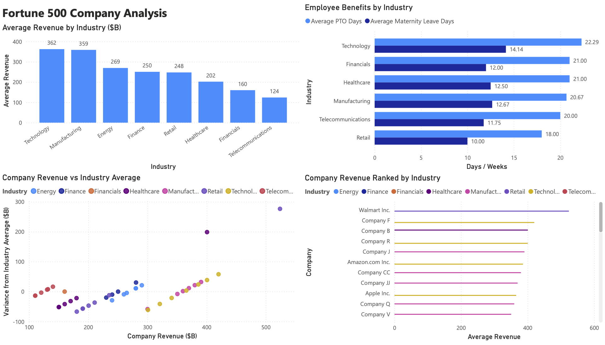

# Fortune 500 Company Analysis

## Overview
Analyzed Fortune 500 company data to uncover trends in revenue performance, 
employee benefits, and industry benchmarking using PostgreSQL. Focused on 
identifying which industries and companies offer the strongest compensation 
packages and how companies compare to their industry peers.

## Dashboard Preview

## Dataset
- Source: Fortune 500 custom database
- 43 companies across 8 industries
- Columns: company name, industry, revenue, employees, healthcare benefits, 
  PTO days, maternity leave weeks, avg employee tenure
- Note: Dataset includes a mix of named Fortune 500 companies and 
  anonymized placeholder companies for privacy purposes

## Business Questions Answered
1. Which industries generate the highest average revenue?
2. Which industries offer the most generous employee benefits?
3. How do companies rank by revenue within their own industry?
4. How does each company's revenue compare to their industry average?
5. Which industries have the strongest combination of PTO and maternity leave?

## SQL Concepts Used
CASE Statements | CTEs | Window Functions | PARTITION BY | RANK() | 
AVG() OVER | GROUP BY | HAVING | Filtering | ROUND()

## Key Findings
- Technology and Manufacturing lead all industries in average revenue 
  at $362B and $359B respectively
- Technology also leads in employee benefits — highest PTO at 22.3 days 
  and maternity leave at 14.1 weeks
- Retail has the weakest benefits package across both PTO and maternity leave
- Walmart Inc. is the highest revenue company in the dataset at $523B, 
  significantly outperforming its Retail industry peers
- Significant revenue variance exists within industries, with top performers 
  earning 2-3x the industry average

## Tools Used
PostgreSQL | Supabase | Power BI | VS Code | GitHub